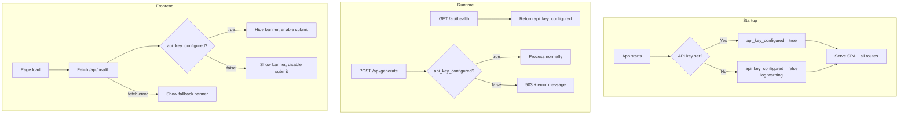

# Design Document: Graceful Missing API Key

## Overview

This feature transforms the OpenStoryMode application from crashing on startup when the OpenRouter API key is missing to gracefully degrading. The app will start normally, serve the SPA, expose a health endpoint reporting configuration status, reject generation requests with a clear 503 error, and display a frontend banner guiding the user to configure their key.

The changes touch four layers:
1. **Config** (`app/config.py`) — add an `api_key_configured` boolean flag, remove the crash-on-missing-key behavior
2. **Lifespan/Routes** (`app/main.py`) — replace `validate_config` crash with a warning log, add `GET /api/health`, guard `POST /api/generate` with a 503 check
3. **Frontend** (`static/index.html`) — fetch `/api/health` on load, show/hide a banner, disable/enable the submit button

No new Python files are needed. No database or external service changes are required.

## Architecture



## Components and Interfaces

### 1. Config (`app/config.py`)

**Current behavior:** `Config.load()` reads the env var. `validate_config()` raises `ValueError` if the key is empty.

**New behavior:**
- Add a computed property `api_key_configured: bool` to the `Config` dataclass, derived from whether `openrouter_api_key` is a non-empty string.
- `validate_config()` is replaced or modified: instead of raising, it logs a warning and returns. The lifespan handler no longer needs to catch exceptions.

```python
@property
def api_key_configured(self) -> bool:
    return bool(self.openrouter_api_key and self.openrouter_api_key.strip())
```

### 2. Lifespan Handler (`app/main.py`)

**Current behavior:** Calls `validate_config(config)` which raises on missing key, crashing the app.

**New behavior:**
- Remove the `validate_config(config)` call (or replace it).
- Check `config.api_key_configured` and log a warning if `False`.
- Continue startup regardless.

```python
@asynccontextmanager
async def lifespan(app: FastAPI) -> AsyncIterator[None]:
    if not config.api_key_configured:
        logger.warning(
            "OPENROUTER_API_KEY is not set. Video generation is disabled. "
            "Set the OPENROUTER_API_KEY environment variable and restart."
        )
    restore_jobs_from_disk(jobs)
    logger.info("Restored %d job(s) from disk", len(jobs))
    logger.info("OpenStoryMode started on port %d", config.port)
    yield
```

### 3. Health Endpoint (`app/main.py`)

New `GET /api/health` route returning JSON:

```python
@app.get("/api/health")
async def health() -> JSONResponse:
    return JSONResponse(content={"api_key_configured": config.api_key_configured})
```

This must be registered before the static files mount so it takes priority.

### 4. Generation Guard (`app/main.py`)

Add a check at the top of the `generate()` handler:

```python
if not config.api_key_configured:
    return JSONResponse(
        status_code=503,
        content={
            "detail": "API key not configured. Set the OPENROUTER_API_KEY environment variable and restart the server."
        },
    )
```

### 5. Frontend Banner (`static/index.html`)

- Add a banner `<div>` (hidden by default) above the form section inside `#create-video-view`.
- On page load, `fetch('/api/health')` and inspect `api_key_configured`.
- If `false`: show banner with the specified text, set `submit-btn.disabled = true`.
- If `true`: hide banner, ensure submit button is enabled.
- If fetch fails: show banner with fallback text "Unable to check server configuration."

The banner element:

```html
<div id="api-key-banner" class="api-key-banner" role="alert" hidden>
  <span id="api-key-banner-text"></span>
</div>
```

Styled with a warning color scheme consistent with the existing `.validation-error` pattern but using an amber/yellow tone to distinguish configuration warnings from validation errors.

## Data Models

### Config Changes

```python
@dataclass
class Config:
    openrouter_api_key: str
    port: int

    @property
    def api_key_configured(self) -> bool:
        return bool(self.openrouter_api_key and self.openrouter_api_key.strip())
```

No changes to `Job`, `GenerationRequest`, `Scene`, or any other model.

### Health Endpoint Response

```json
{
  "api_key_configured": true | false
}
```

### Generation 503 Response

```json
{
  "detail": "API key not configured. Set the OPENROUTER_API_KEY environment variable and restart the server."
}
```

No new database tables, no new files, no schema migrations.


## Correctness Properties

*A property is a characteristic or behavior that should hold true across all valid executions of a system — essentially, a formal statement about what the system should do. Properties serve as the bridge between human-readable specifications and machine-verifiable correctness guarantees.*

### Property 1: API key configured flag correctness

*For any* string value used as `openrouter_api_key`, `config.api_key_configured` should be `True` if and only if the string contains at least one non-whitespace character, and `False` otherwise.

**Validates: Requirements 1.2, 1.3**

### Property 2: Generate endpoint gating

*For any* valid generation request (valid prompt, video_length, aspect_ratio), the `POST /api/generate` endpoint should return HTTP 503 with the specified error message if and only if `config.api_key_configured` is `False`; otherwise it should accept the request normally (HTTP 202).

**Validates: Requirements 2.1, 2.2**

### Property 3: Health endpoint reflects config state

*For any* application configuration state, the `GET /api/health` endpoint should return a JSON object whose `api_key_configured` field equals the current value of `config.api_key_configured`.

**Validates: Requirements 3.2, 3.3, 3.4**

## Error Handling

| Scenario | Behavior |
|---|---|
| API key missing at startup | Log warning, continue startup. No exception raised. |
| `POST /api/generate` with no API key | Return 503 with JSON `{"detail": "API key not configured. Set the OPENROUTER_API_KEY environment variable and restart the server."}` |
| `GET /api/health` always succeeds | Returns 200 with `{"api_key_configured": bool}` regardless of config state |
| Frontend health check fails (network error) | Show fallback banner: "Unable to check server configuration." |
| API key is whitespace-only | Treated as missing — `api_key_configured` is `False` |

No new exception types are needed. The existing `HTTPException` and `JSONResponse` patterns in `app/main.py` are sufficient.

## Testing Strategy

### Unit Tests (pytest)

Unit tests cover specific examples and edge cases:

- **Config flag**: empty string → `False`, whitespace → `False`, valid key → `True`
- **Lifespan**: app starts without crash when key is missing (no `ValueError` raised)
- **Health endpoint**: returns `{"api_key_configured": true}` when key is set, `{"api_key_configured": false}` when not
- **Generate guard**: returns 503 with correct message when key is missing, returns 202 when key is present
- **SPA serving**: root URL serves `index.html` regardless of key state

Use the existing `TestClient` + `unittest.mock.patch` patterns from `tests/test_main.py`.

### Property-Based Tests (Hypothesis)

The project already includes `hypothesis` in `requirements.txt`. Each correctness property maps to a single property-based test with a minimum of 100 iterations.

- **Property 1 test**: Generate random strings (including empty, whitespace-only, and non-empty). Assert `Config(openrouter_api_key=s, port=8000).api_key_configured == bool(s and s.strip())`.
  - Tag: `Feature: graceful-missing-api-key, Property 1: API key configured flag correctness`

- **Property 2 test**: Generate random valid prompts, video lengths, and aspect ratios. With `api_key_configured` patched to `False`, assert 503 response. With it as `True`, assert 202 response.
  - Tag: `Feature: graceful-missing-api-key, Property 2: Generate endpoint gating`

- **Property 3 test**: Generate random boolean values for `api_key_configured`. Patch the config, call `/api/health`, assert the response field matches.
  - Tag: `Feature: graceful-missing-api-key, Property 3: Health endpoint reflects config state`

Each property-based test must:
- Use `@given(...)` from Hypothesis with appropriate strategies
- Run at least 100 examples (`@settings(max_examples=100)`)
- Include a comment referencing the design property number and text
- Be implemented as a single test function per property
