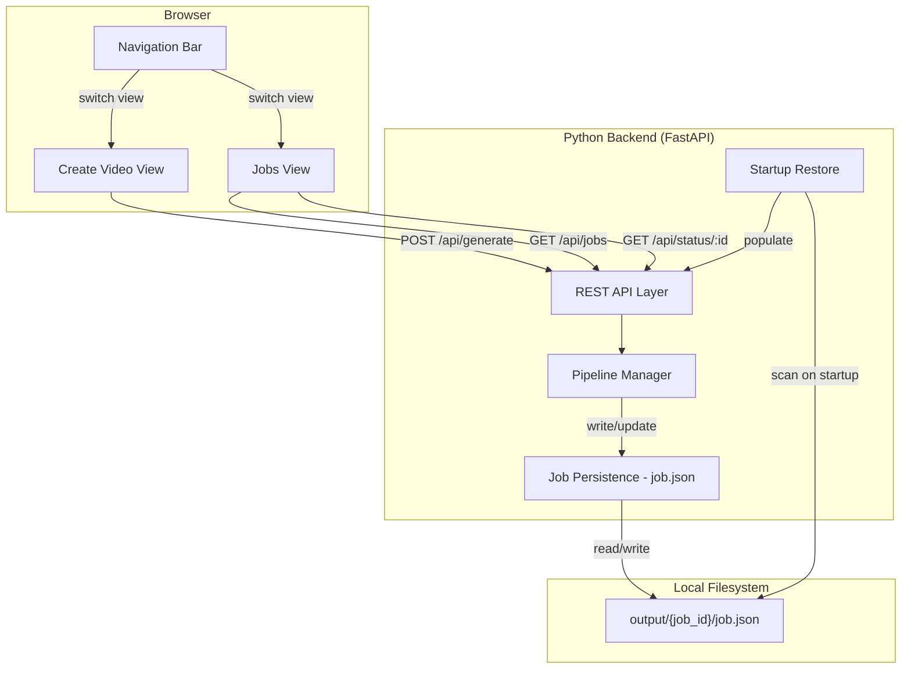
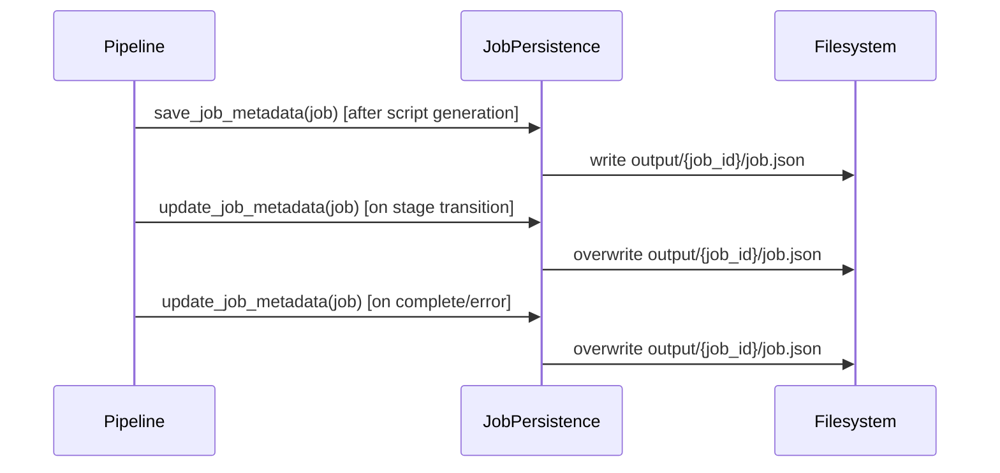
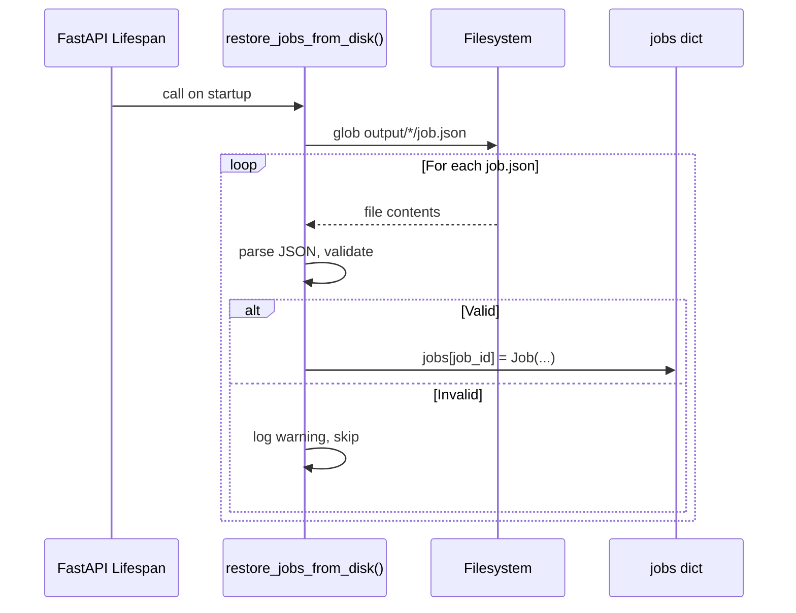

# Design Document: Job History Navigation

## Overview

This feature adds persistence, navigation, and history browsing to OpenStoryMode. Currently, the app is a single-view form that loses all job state on server restart. This design introduces three interconnected capabilities:

1. **Job metadata persistence** — Each job writes a `job.json` file to its output directory, capturing prompt, parameters, status, timestamps, script, and error info. On startup, the server scans these files to restore the in-memory job store.
2. **Navigation bar** — A persistent top-level nav replaces the current static header, enabling switching between "Create Video", "Jobs", and an external "GitHub" link.
3. **Jobs view** — A new view lists all past and in-progress jobs as cards with status, prompt, script, progress, video playback, and error details.

The backend changes are additive (new endpoint, new persistence module, startup scan). The frontend changes restructure the single-page app into a multi-view SPA with client-side routing via the nav bar.

## Architecture



### Data Flow: Job Persistence



### Data Flow: Startup Restoration



## Components and Interfaces

### Backend Components

#### 1. Job Persistence Module (`app/job_persistence.py`)

New module responsible for writing and reading `job.json` files.

```python
def save_job_metadata(job: Job) -> None:
    """Write the full job.json to output/{job_id}/job.json."""

def update_job_metadata(job: Job) -> None:
    """Overwrite job.json with current job state."""

def load_job_metadata(path: Path) -> Optional[dict]:
    """Read and parse a single job.json file. Returns None on failure."""

def restore_jobs_from_disk(jobs_store: dict[str, Job]) -> None:
    """Scan output/*/job.json, parse each, populate jobs_store."""
```

#### 2. Pipeline Integration

The existing `run_pipeline()` in `app/pipeline.py` will be modified to call persistence functions at key points:
- After script generation completes → `save_job_metadata(job)` (initial write with script)
- On each stage transition → `update_job_metadata(job)`
- On completion → `update_job_metadata(job)` (status=complete)
- On error → `update_job_metadata(job)` (status=error, error details)

#### 3. Job Model Changes (`app/models.py`)

Add timestamp fields to the `Job` dataclass:

```python
@dataclass
class Job:
    # ... existing fields ...
    created_at: str = field(default_factory=lambda: datetime.utcnow().isoformat() + "Z")
    updated_at: Optional[str] = None
```

#### 4. List Jobs Endpoint (`GET /api/jobs`)

New endpoint in `app/main.py`:

```python
@app.get("/api/jobs")
async def list_jobs() -> JSONResponse:
    """Return all jobs sorted by created_at descending."""
```

Returns a JSON array where each element includes: `job_id`, `prompt`, `video_length`, `aspect_ratio`, `status`, `stage`, `progress_pct`, `created_at`, `updated_at`, `error`, `error_stage`, `script`, `video_url`.

#### 5. Startup Restoration

The `lifespan` function in `app/main.py` will call `restore_jobs_from_disk(jobs)` after config validation, before yielding.

### Frontend Components

#### 6. Navigation Bar

Replaces the current `<header>` element. Contains three nav items:
- "Create Video" — switches to the form view
- "Jobs" — switches to the jobs list view
- "GitHub" — opens the repo URL in a new tab (`target="_blank"`)

Active item is visually highlighted. Navigation is handled by toggling `hidden` attributes on view containers (no URL routing needed).

#### 7. Jobs View

A new `<section id="jobs-view">` containing:
- Fetch logic calling `GET /api/jobs` on view activation
- Job cards rendered from the response array
- Empty state message when no jobs exist

#### 8. Job Card

Each card displays:
- Prompt text
- Script (scene breakdown) when available
- Status badge: "In Progress", "Complete", or "Error"
- For in-progress: progress bar with stage name and percentage, polling `GET /api/status/{job_id}`
- For complete: inline `<video>` player and download button
- For error: error message and failed stage

#### 9. Post-Submit Redirect

After a successful `POST /api/generate` response, the frontend:
1. Switches active view to Jobs view
2. Refreshes the job list
3. Resets the Create Video form to defaults


## Data Models

### job.json Schema

```json
{
  "job_id": "uuid-string",
  "prompt": "user prompt text",
  "video_length": "30s",
  "aspect_ratio": "16:9",
  "status": "complete",
  "created_at": "2025-01-15T10:30:00Z",
  "updated_at": "2025-01-15T10:35:00Z",
  "error": null,
  "error_stage": null,
  "script": [
    {
      "index": 0,
      "narration_text": "Scene narration...",
      "visual_description": "Scene visual..."
    }
  ]
}
```

Field definitions:
- `job_id` (string, required): UUID identifying the job
- `prompt` (string, required): Original user prompt
- `video_length` (string, required): One of "10s", "30s", "60s", "90s"
- `aspect_ratio` (string, required): One of "9:16", "16:9"
- `status` (string, required): One of "queued", "script_generation", "visual_generation", "tts_synthesis", "video_assembly", "complete", "error"
- `created_at` (string, required): ISO 8601 timestamp
- `updated_at` (string, nullable): ISO 8601 timestamp, set on every status change
- `error` (string, nullable): Error message when status is "error"
- `error_stage` (string, nullable): Pipeline stage where error occurred
- `script` (array, nullable): List of scene objects, populated after script generation

### GET /api/jobs Response Schema

```json
[
  {
    "job_id": "uuid",
    "prompt": "text",
    "video_length": "30s",
    "aspect_ratio": "16:9",
    "status": "complete",
    "stage": "complete",
    "progress_pct": 100,
    "created_at": "2025-01-15T10:30:00Z",
    "updated_at": "2025-01-15T10:35:00Z",
    "error": null,
    "error_stage": null,
    "script": [...],
    "video_url": "/api/video/uuid"
  }
]
```

The array is sorted by `created_at` descending (newest first).

### Job Model Updates

```python
@dataclass
class Job:
    job_id: str = field(default_factory=lambda: str(uuid.uuid4()))
    request: Optional[GenerationRequest] = None
    stage: JobStage = JobStage.QUEUED
    scenes: list[Scene] = field(default_factory=list)
    assets: list[SceneAsset] = field(default_factory=list)
    video_path: Optional[Path] = None
    error: Optional[str] = None
    error_stage: Optional[JobStage] = None
    created_at: str = field(default_factory=lambda: datetime.utcnow().isoformat() + "Z")
    updated_at: Optional[str] = None
```


## Correctness Properties

*A property is a characteristic or behavior that should hold true across all valid executions of a system — essentially, a formal statement about what the system should do. Properties serve as the bridge between human-readable specifications and machine-verifiable correctness guarantees.*

### Property 1: Job metadata serialization round-trip

*For any* valid Job with any combination of status (queued, script_generation, visual_generation, tts_synthesis, video_assembly, complete, error), prompt, video_length, aspect_ratio, timestamps, and optional script/error fields, serializing the job to a `job.json` file and then loading it back should produce a dictionary containing all the original field values: job_id, prompt, video_length, aspect_ratio, status, created_at, updated_at, error, error_stage, and script.

**Validates: Requirements 1.1, 1.2, 1.3, 1.4, 1.5, 7.2**

### Property 2: Restore from disk populates job store with all valid files

*For any* set of valid job.json files written to distinct `output/{job_id}/` directories, calling `restore_jobs_from_disk()` should populate the job store with exactly one entry per valid file, keyed by job_id, and the total count should equal the number of valid files written.

**Validates: Requirements 2.1, 2.4**

### Property 3: Invalid job.json files are skipped without error

*For any* string that is not valid JSON (or valid JSON missing required fields), when written to an `output/{job_id}/job.json` path, calling `restore_jobs_from_disk()` should skip that file, not raise an exception, and not include it in the job store.

**Validates: Requirements 2.2**

### Property 4: GET /api/jobs returns all jobs with required fields sorted by created_at descending

*For any* set of jobs in the job store with distinct created_at timestamps, the `GET /api/jobs` endpoint should return a JSON array containing one entry per job, each entry containing all required fields (job_id, prompt, video_length, aspect_ratio, status, stage, progress_pct, created_at, updated_at, error, error_stage, script, video_url), and the array should be sorted by created_at in descending order.

**Validates: Requirements 3.1, 3.2, 3.3**

### Property 5: Job created_at is valid ISO 8601

*For any* newly created Job, the `created_at` field should be a valid ISO 8601 timestamp string that can be parsed back to a datetime object.

**Validates: Requirements 7.1**

### Property 6: Job card renders appropriate content for job status

*For any* job, the rendered job card should contain the prompt text. If the job has a script, the card should contain scene narration and visual descriptions. If the job status is "complete", the card should contain a video player element and download link. If the job status is "error", the card should contain the error message and error stage.

**Validates: Requirements 5.2, 5.3, 5.4, 5.7, 5.8**

### Property 7: Navigation view switching shows exactly one view

*For any* navigation item click (excluding external links), exactly one view section should be visible and all other view sections should be hidden.

**Validates: Requirements 4.3, 4.4**

## Error Handling

### Backend Errors

| Scenario | Handling |
|---|---|
| `job.json` write fails (disk full, permissions) | Log error, pipeline continues (job still works in-memory, persistence is best-effort) |
| `job.json` contains invalid JSON on startup | Log warning with file path, skip file, continue loading other jobs |
| Job directory exists without `job.json` | Skip silently during startup scan |
| `GET /api/jobs` with empty store | Return empty JSON array `[]` |
| `job.json` has missing required fields | Treat as invalid, log warning, skip during restore |

### Frontend Errors

| Scenario | Handling |
|---|---|
| `GET /api/jobs` network failure | Show error message in Jobs view, offer retry |
| `GET /api/status/{job_id}` poll failure | Stop polling for that job, show stale state |
| Video URL returns 404 | Hide video player, show "Video unavailable" message |

### Design Decisions

1. **Best-effort persistence**: `job.json` writes are best-effort. If a write fails, the pipeline continues and the job works normally in-memory. This avoids blocking video generation on filesystem issues.
2. **No migration/versioning**: The `job.json` schema is simple and flat. If the schema changes in the future, old files that fail validation are simply skipped on restore.
3. **Client-side view switching**: Navigation uses `hidden` attribute toggling rather than URL-based routing. This keeps the implementation simple (no router library, no history API) while meeting the requirements.
4. **Polling for in-progress jobs**: The Jobs view polls `GET /api/status/{job_id}` for each in-progress job, reusing the existing polling infrastructure from the Create Video view.

## Testing Strategy

### Property-Based Testing

The project already uses **Hypothesis** (listed in `requirements.txt`) as the property-based testing library. Each correctness property will be implemented as a single Hypothesis test with a minimum of 100 examples.

Each property test must be tagged with a comment referencing the design property:
```python
# Feature: job-history-navigation, Property 1: Job metadata serialization round-trip
```

Property tests focus on:
- **Property 1**: Generate random Job objects with varied statuses, prompts, and scripts. Serialize to `job.json`, read back, verify all fields match.
- **Property 2**: Generate random sets of valid job metadata dicts, write to temp directories, run restore, verify store contents.
- **Property 3**: Generate random invalid strings (not valid JSON, or JSON missing required keys). Write to job.json paths, run restore, verify no crash and no store entries.
- **Property 4**: Generate random sets of Job objects with distinct timestamps, populate the store, call the endpoint, verify response shape and sort order.
- **Property 5**: Generate random Job objects, verify `created_at` parses as ISO 8601.

Properties 6 and 7 are frontend DOM properties. These are better validated through manual testing or integration tests rather than Hypothesis, since they require a browser DOM. They should be covered by unit tests with specific examples.

### Unit Testing

Unit tests complement property tests by covering specific examples, edge cases, and integration points:

- **Persistence edge cases**: Empty script list, very long prompts, special characters in prompts, null error fields
- **Startup restore**: Directory with no `job.json`, empty output directory, mixed valid/invalid files
- **API endpoint**: `GET /api/jobs` with empty store, single job, multiple jobs; verify response structure
- **Timestamp format**: Verify ISO 8601 format with timezone indicator
- **Navigation**: Verify nav bar HTML structure contains required items
- **Post-submit redirect**: Verify form reset and view switch after successful submission
- **Empty state**: Verify Jobs view shows appropriate message when no jobs exist

### Test Organization

```
tests/
  test_job_persistence.py    # Property tests + unit tests for save/load/restore
  test_main.py               # Extended with GET /api/jobs tests, timestamp tests
```

