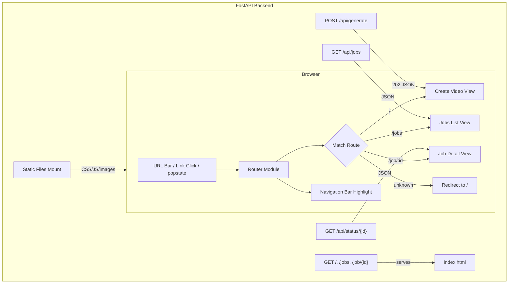

# Design Document: Job Page Routing

## Overview

This design introduces client-side URL routing to the OpenStoryMode SPA, replacing the current tab-based navigation (which keeps the URL at `/` regardless of view) with History API-based routing. The three routes are:

- `/` — Create Video form
- `/jobs` — Jobs list (multi-column card grid)
- `/job/{job_id}` — Job detail (two-column layout)

The backend gains a catch-all HTML route so that direct navigation, bookmarks, and browser refresh all serve `index.html`, letting the client-side router take over. The existing `/api/*` endpoints and static asset serving remain unchanged.

Key design decisions:
1. **History API over hash routing** — cleaner URLs, better shareability, standard browser back/forward support.
2. **Vanilla JS router** — no framework dependency; the app is already vanilla JS, so a lightweight custom router keeps the stack consistent.
3. **Backend catch-all via explicit FastAPI routes** — rather than middleware, we add explicit GET routes for `/`, `/jobs`, and `/job/{job_id}` that return `index.html`, registered before the static file mount so they take priority.

## Architecture



The router is a simple module inside the existing `<script>` block in `index.html`. It listens for `popstate` events and intercepts link clicks. Each route handler shows/hides the appropriate view section and triggers any necessary data fetching.

## Components and Interfaces

### 1. Client-Side Router

A lightweight router object embedded in the existing IIFE in `index.html`.

```javascript
// Router interface
const Router = {
  routes: [],                    // Array of { pattern: RegExp, handler: Function }
  init(),                        // Register routes, bind popstate, run initial route
  navigate(path),                // pushState + dispatch route
  _dispatch(path),               // Match path against routes, call handler
  _onPopState(event),            // Handle browser back/forward
};
```

**Route definitions:**
| Pattern | Handler |
|---|---|
| `/` (exact) | `showCreateVideoView()` |
| `/jobs` (exact) | `showJobsListView()` |
| `/job/:job_id` | `showJobDetailView(jobId)` |
| fallback | `Router.navigate('/')` |

### 2. Backend Catch-All Routes

Three explicit FastAPI route handlers registered **before** the static files mount:

```python
@app.get("/")
@app.get("/jobs")
@app.get("/job/{job_id}")
async def serve_spa(...) -> FileResponse:
    return FileResponse("static/index.html", media_type="text/html")
```

These must be registered before `app.mount("/", StaticFiles(...))` so they take priority. The existing `/api/*` routes are already registered first and remain unaffected.

### 3. Navigation Bar

The existing nav bar markup is updated:
- `href` attributes change from `#` to actual paths (`/`, `/jobs`)
- Click handler calls `Router.navigate(path)` instead of toggling views directly
- Active state is derived from `window.location.pathname` in the router dispatch

### 4. Jobs List View (Card Grid)

Replaces the current single-column jobs list with a responsive multi-column grid:

```css
.jobs-grid {
  display: grid;
  grid-template-columns: repeat(auto-fill, minmax(280px, 1fr));
  gap: 1rem;
}
```

Each `Job_Summary_Card` shows:
- Prompt text (truncated with CSS `line-clamp`)
- Status badge (In Progress / Complete / Error)
- "View Details" button linking to `/job/{job_id}`

The existing detailed card content (script, progress bars, inline video) is removed from the list view and moved to the detail view.

### 5. Job Detail View (Two-Column Layout)

A new view section with a two-column CSS grid:

```css
.job-detail {
  display: grid;
  grid-template-columns: 1fr 1fr;
  gap: 2rem;
}

@media (max-width: 768px) {
  .job-detail { grid-template-columns: 1fr; }
}
```

**Left column:** Prompt, metadata (video length, aspect ratio, created_at, status), progress indicator (if in-progress), error info (if error).

**Right column:** Video player with `autoplay` disabled (if complete), download button (if complete). Empty/placeholder when not complete.

### 6. Post-Submit Navigation

The existing submit handler is modified to call `Router.navigate('/jobs')` after a successful `POST /api/generate` response, replacing the current manual view toggling. The form reset logic remains.

## Data Models

No new backend data models are needed. The existing `Job`, `GenerationRequest`, `JobStage`, and `Scene` models are sufficient. The API responses from `GET /api/jobs` and `GET /api/status/{job_id}` already contain all fields needed by the new views.

**Client-side route state:**

```javascript
// Implicit state — no new model, just the URL path
// The router extracts job_id from the path pattern:
// /job/:job_id → { job_id: string }
```

**Job Summary Card data** (subset of `/api/jobs` response per item):
- `job_id` — for building the detail link
- `prompt` — displayed text
- `status` — for the badge

**Job Detail View data** (from `/api/status/{job_id}` response):
- `prompt`, `video_length`, `aspect_ratio`, `created_at` — left column metadata
- `status`, `stage`, `progress_pct` — progress indicator
- `error`, `error_stage` — error display
- `video_url`, `metadata` — right column video player


## Correctness Properties

*A property is a characteristic or behavior that should hold true across all valid executions of a system — essentially, a formal statement about what the system should do. Properties serve as the bridge between human-readable specifications and machine-verifiable correctness guarantees.*

### Property 1: Route parameter extraction

*For any* string `job_id`, when the router processes the path `/job/{job_id}`, it shall extract exactly that `job_id` string and pass it to the Job Detail View handler.

**Validates: Requirements 1.3**

### Property 2: Navigation round-trip

*For any* sequence of valid route paths, calling `Router.navigate(path)` should set `window.location.pathname` to that path, and subsequently triggering a `popstate` event (browser back) should restore the previous path and its corresponding view.

**Validates: Requirements 1.4, 1.5**

### Property 3: Unknown route fallback

*For any* URL path string that does not match `/`, `/jobs`, or `/job/{id}`, the router shall redirect to `/` and display the Create Video View.

**Validates: Requirements 1.6**

### Property 4: Backend catch-all serves index.html

*For any* `job_id` string, a GET request to `/job/{job_id}` shall return an HTML response containing the SPA `index.html` content. The same holds for GET `/` and GET `/jobs`.

**Validates: Requirements 2.1**

### Property 5: Nav bar active state matches current route

*For any* route path that maps to a nav item (`/` → "Create Video", `/jobs` → "Jobs"), after the router dispatches that path, exactly one nav item shall have the `active` class, and it shall be the one corresponding to the current path.

**Validates: Requirements 3.3, 3.4**

### Property 6: Job summary card contains required elements

*For any* job object with a `job_id`, `prompt`, and `status`, the rendered Job Summary Card shall contain: the prompt text (or a truncated version), a status badge with the correct label ("In Progress", "Complete", or "Error"), and a "View Details" link whose href is `/job/{job_id}`.

**Validates: Requirements 4.1, 4.4, 4.5**

### Property 7: Job detail view renders all job information

*For any* job object, the Job Detail View shall render the original prompt text and all metadata fields (video length, aspect ratio, creation timestamp, and current status) in the left column.

**Validates: Requirements 5.2, 5.3**

### Property 8: Status-specific detail rendering

*For any* job object:
- If status is in-progress, the detail view shall display the pipeline stage name and progress percentage.
- If status is "error", the detail view shall display the error message and the error stage.
- If status is "complete", the detail view shall display a video element with the correct `src` (and no `autoplay` attribute) and a download link.

**Validates: Requirements 5.4, 5.5, 5.6, 5.7, 5.8**

### Property 9: Form reset after submission

*For any* form state (non-empty prompt, any selected video length and aspect ratio), after a successful submission and navigation to `/jobs`, the prompt field shall be empty, video length shall be "30s", and aspect ratio shall be "9:16".

**Validates: Requirements 6.3**

## Error Handling

### Client-Side Errors

| Scenario | Handling |
|---|---|
| Unrecognized URL path | Router redirects to `/` (Create Video View) |
| Job detail for non-existent job (404 from API) | Display error message with link back to `/jobs` |
| `/api/jobs` fetch failure | Show error message in Jobs List View ("Failed to load jobs") |
| `/api/status/{job_id}` fetch failure | Show error message in Job Detail View, stop polling |
| Network error during polling | Stop polling, show connection error message |

### Backend Errors

| Scenario | Handling |
|---|---|
| GET `/job/{job_id}` with any job_id | Always returns `index.html` (routing is client-side); no 404 at the HTML level |
| API routes return errors | Existing error handling unchanged (404 for missing jobs, 422 for validation) |

### Edge Cases

- **Empty jobs list**: Display "No jobs yet" message with CTA to create a video.
- **Long prompt text**: Truncated with CSS `line-clamp` in card view; shown in full on detail view.
- **Rapid navigation**: Router debounces by checking current path before dispatching; `stopAllJobPolling()` called on every view transition to prevent stale timers.
- **Direct URL load with stale job_id**: Client fetches status, gets 404, shows error with back link.

## Testing Strategy

### Testing Framework

- **Backend**: `pytest` with `httpx.AsyncClient` (via FastAPI's `TestClient`) — already established in the project.
- **Frontend**: Property-based tests using `fast-check` via a lightweight test runner (e.g., the router logic can be extracted into testable pure functions).
- **Property-based testing library**: `fast-check` (JavaScript) for client-side properties, `hypothesis` (Python) for backend properties.

### Unit Tests

Unit tests cover specific examples, edge cases, and integration points:

- **Backend catch-all routes**: Verify GET `/`, `/jobs`, `/job/some-id` all return 200 with HTML content-type. Verify `/api/jobs` still returns JSON.
- **Router dispatch**: Test each specific route (`/`, `/jobs`, `/job/abc-123`) calls the correct handler.
- **Nav bar active state**: Test that clicking each nav item sets the correct active class.
- **Empty jobs list**: Verify the empty state message renders.
- **Non-existent job detail**: Verify 404 handling shows error with back link.
- **Video player autoplay**: Verify the video element does not have the `autoplay` attribute.
- **Post-submit navigation**: Verify form resets and view switches to jobs after successful generate.

### Property-Based Tests

Each property test must run a minimum of 100 iterations and reference its design property.

| Property | Test Description | Library |
|---|---|---|
| Property 1 | Generate random job_id strings, verify router extracts them correctly from `/job/{job_id}` | fast-check |
| Property 2 | Generate random sequences of valid paths, navigate forward then back, verify path restoration | fast-check |
| Property 3 | Generate random non-matching path strings, verify router redirects to `/` | fast-check |
| Property 4 | Generate random job_id strings, send GET `/job/{job_id}`, verify HTML response | hypothesis |
| Property 5 | Generate random valid route paths, verify exactly one nav item is active and matches the path | fast-check |
| Property 6 | Generate random job objects (id, prompt, status), verify rendered card contains all required elements | fast-check |
| Property 7 | Generate random job objects with all metadata fields, verify detail view renders all fields | fast-check |
| Property 8 | Generate random job objects with each status type, verify status-specific content is rendered | fast-check |
| Property 9 | Generate random form states, simulate submission, verify form resets to defaults | fast-check |

Each test must be tagged with: **Feature: job-page-routing, Property {number}: {property_text}**

Each correctness property must be implemented by a single property-based test.
