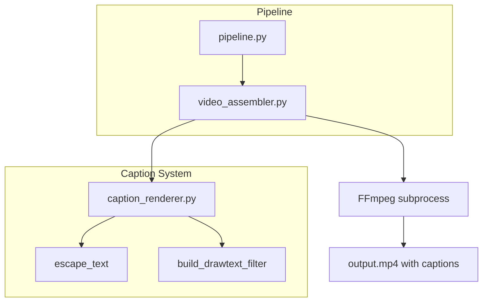

# Design Document: Typewriter Captions

## Overview

This feature adds a typewriter-style caption overlay to videos produced by OpenStoryMode. Each scene's `narration_text` is revealed character-by-character over the duration of the scene's audio, creating a "typed as spoken" effect. The captions are rendered directly into the MP4 via FFmpeg `drawtext` filters during video assembly — no separate subtitle file or post-processing step is needed.

The implementation introduces a new `CaptionRenderer` module (`app/caption_renderer.py`) responsible for:
1. Escaping narration text for FFmpeg drawtext syntax.
2. Computing per-character reveal timing based on audio duration.
3. Generating the FFmpeg `drawtext` filter expression for each scene.

The existing `VideoAssembler` is extended to accept narration text per scene and inject caption filter expressions into its filter graph. A new `CaptionMode` enum on `GenerationRequest` controls caption behavior (defaults to `YES`). The mode supports three values: `YES` (captioned output only), `NO` (no captions), and `BOTH` (produces two MP4 files — one with captions and one without).

## Architecture



The caption system is a pure-function library consumed by the video assembler. It has no I/O, no state, and no dependencies beyond the Python standard library. This keeps it easy to test and reason about.

### Data flow

1. `pipeline.py` passes `scenes` (with `narration_text`) and `caption_mode` to `assemble_video()`.
2. `video_assembler.py` calls `caption_renderer.build_drawtext_filter()` for each scene, receiving an FFmpeg filter string.
3. The drawtext filter is chained after the existing `scale/pad` filters for each scene's video stream.
4. For multi-scene videos, each drawtext filter is scoped to its scene's time window using the `enable='between(t,start,end)'` expression.
5. When `caption_mode` is `BOTH`, the assembler runs the FFmpeg pipeline twice — once with caption filters and once without — producing two output files (`output_captioned.mp4` and `output.mp4`).

## Components and Interfaces

### 1. `app/caption_renderer.py` (new module)

This module exposes pure functions — no classes, no I/O.

```python
def escape_ffmpeg_text(text: str) -> str:
    """Escape special characters for FFmpeg drawtext filter.
    
    Characters requiring escaping: : \ ' ; [ ] =
    FFmpeg drawtext uses backslash escaping.
    Non-renderable characters are replaced with a space.
    
    Round-trip property: unescape(escape(text)) == text
    for all valid narration_text strings.
    """

def unescape_ffmpeg_text(escaped: str) -> str:
    """Reverse the escaping performed by escape_ffmpeg_text.
    
    Used for testing the round-trip property.
    """

def build_drawtext_filter(
    text: str,
    duration: float,
    video_width: int,
    video_height: int,
    start_time: float = 0.0,
    crossfade_duration: float = 0.0,
) -> str:
    """Generate an FFmpeg drawtext filter expression for typewriter captions.
    
    Args:
        text: Raw narration text (will be escaped internally).
        duration: Audio duration in seconds for this scene.
        video_width: Output video width in pixels.
        video_height: Output video height in pixels.
        start_time: Offset in seconds from the start of the final video
                     where this scene begins.
        crossfade_duration: Duration of crossfade transition in seconds.
                            Caption starts after crossfade completes.
    
    Returns:
        A complete FFmpeg drawtext filter string including:
        - Character reveal via text expansion using the `text` and `enable` params
        - Positioning in the lower third
        - Semi-transparent background box
        - Word wrapping via FFmpeg's text_w / line_h layout
        - Time-scoped enable expression for multi-scene videos
    """
```

### 2. `app/video_assembler.py` (modified)

Changes to the existing module:

```python
async def assemble_video(
    assets: list[SceneAsset],
    job_id: str,
    aspect_ratio: AspectRatio,
    scenes: list[Scene] | None = None,       # NEW — narration text source
    caption_mode: CaptionMode = CaptionMode.YES,  # NEW — three-way caption mode
) -> Path | tuple[Path, Path]:
```

- `_assemble_single_scene` and `_assemble_multi_scene` gain optional caption filter injection.
- Caption filters are chained after the existing `scale/pad/format` filter for each video stream.
- When `caption_mode=NO` or `scenes` is `None`, behavior is identical to today (single output, no captions).
- When `caption_mode=YES`, a single captioned output is produced at `output.mp4`.
- When `caption_mode=BOTH`, the assembler runs the filter graph twice:
  1. First pass: `output.mp4` (no captions)
  2. Second pass: `output_captioned.mp4` (with captions)
  Returns a tuple of `(captioned_path, no_captions_path)`.

### 3. `app/models.py` (modified)

```python
class CaptionMode(str, Enum):
    YES = "yes"       # Generate video with captions only
    NO = "no"         # Generate video without captions only
    BOTH = "both"     # Generate two files: one with, one without

@dataclass
class GenerationRequest:
    prompt: str
    video_length: VideoLength
    aspect_ratio: AspectRatio
    caption_mode: CaptionMode = CaptionMode.YES  # NEW — defaults to YES
```

### 4. `app/pipeline.py` (modified)

The `run_pipeline` function passes `job.scenes` and `job.request.caption_mode` to `assemble_video()`. When `caption_mode` is `BOTH`, the pipeline receives two paths back and stores both on the `Job` object (via a new `video_paths: list[Path]` field, in addition to the existing `video_path` which points to the primary output).

### 5. `app/main.py` (modified)

The `GenerateRequest` Pydantic model gains an optional `caption_mode: str = "yes"` field. The validation layer maps this to the `CaptionMode` enum and rejects invalid values. The API status response includes `video_urls` (list) when `caption_mode=BOTH`.


## Data Models

### CaptionStyle (constants in `caption_renderer.py`)

These are module-level constants, not a class — keeping things simple:

| Constant | Value | Description |
|---|---|---|
| `FONT_FAMILY` | `"Sans"` | Sans-serif font for FFmpeg drawtext |
| `FONT_SIZE_HORIZONTAL` | `32` | Font size for 1280×720 |
| `FONT_SIZE_VERTICAL` | `28` | Font size for 720×1280 |
| `FONT_COLOR` | `"white"` | Text color |
| `BOX_COLOR` | `"black@0.5"` | Semi-transparent background |
| `BOX_BORDER_W` | `10` | Padding inside the background box (pixels) |
| `MAX_WIDTH_RATIO` | `0.8` | Caption block max width as fraction of frame width |
| `LOWER_THIRD_Y_RATIO` | `0.75` | Y position as fraction of frame height |

### FFmpeg drawtext filter anatomy

The generated filter expression for a single scene looks like:

```
drawtext=text='<escaped_text>'
  :fontfile=''
  :fontsize=32
  :fontcolor=white
  :box=1:boxcolor=black@0.5:boxborderw=10
  :x=(w-text_w)/2
  :y=h*0.75
  :enable='between(t,<start>,<end>)'
  :expansion=normal
```

The typewriter reveal is achieved by dynamically truncating the displayed text using FFmpeg's expression expansion. Specifically, we use the `text` parameter with FFmpeg's `%{eif}` expression to compute how many characters to show based on the current timestamp:

```
drawtext=textfile=<temp_file>
  ...
  :text='%{eif\:clip(trunc((t-<start>)/<char_interval>)+1,0,<total_chars>)\:d}'
```

However, FFmpeg's `drawtext` does not natively support "show first N characters." The practical approach is to use the `enable` expression combined with multiple stacked drawtext filters — one per "chunk" of text — or to use the `textfile` approach with a helper.

**Chosen approach**: Use a single `drawtext` filter per scene with the full escaped text and the `alpha` expression to fade in. For the true character-by-character reveal, we generate **one drawtext filter per character group** (chunked by word boundaries to keep filter count manageable) with staggered `enable='between(t, reveal_time, scene_end)'` expressions. Each chunk shows the next word, creating a word-by-word typewriter effect that is visually equivalent and keeps the filter graph tractable.

**Revised approach — word-level reveal**: Rather than one filter per character (which would create hundreds of filters), we reveal text word-by-word. Each word gets its own `drawtext` filter with:
- The full text up to and including that word
- An `enable` expression that activates at the word's reveal time and stays active until the scene ends
- Each successive filter overlays the previous one, so only the latest (longest) text is visible

This means for a scene with N words, we generate N drawtext filters stacked in sequence. The last one (showing all words) remains visible until the scene ends.

### Modified `GenerationRequest`

```python
class CaptionMode(str, Enum):
    YES = "yes"
    NO = "no"
    BOTH = "both"

@dataclass
class GenerationRequest:
    prompt: str
    video_length: VideoLength
    aspect_ratio: AspectRatio
    caption_mode: CaptionMode = CaptionMode.YES
```

### Modified `assemble_video` signature

```python
async def assemble_video(
    assets: list[SceneAsset],
    job_id: str,
    aspect_ratio: AspectRatio,
    scenes: list[Scene] | None = None,
    caption_mode: CaptionMode = CaptionMode.YES,
) -> Path | tuple[Path, Path]:
```

When `scenes` is provided and `caption_mode` is `YES`, the assembler calls `build_drawtext_filter()` for each scene and injects the resulting filter expressions into the FFmpeg filter graph, producing a single `output.mp4`.

When `caption_mode` is `BOTH`, the assembler runs the pipeline twice:
1. `output.mp4` — assembled without caption filters
2. `output_captioned.mp4` — assembled with caption filters

Both paths are returned as a tuple `(captioned_path, no_captions_path)`. The pipeline stores both on the `Job` object.

## Correctness Properties

*A property is a characteristic or behavior that should hold true across all valid executions of a system — essentially, a formal statement about what the system should do. Properties serve as the bridge between human-readable specifications and machine-verifiable correctness guarantees.*

### Property 1: Even character reveal timing

*For any* non-empty narration text and any positive audio duration, the word reveal times generated by `build_drawtext_filter` shall be evenly distributed across the duration such that: (a) the first word is revealed at or near time 0, (b) the last word is revealed at or before the audio end time, and (c) the interval between consecutive word reveals is approximately `duration / total_characters * characters_in_word`.

**Validates: Requirements 1.1, 1.2, 1.3**

### Property 2: Drawtext filter styling correctness

*For any* valid video dimensions (both 1280×720 and 720×1280) and any non-empty narration text, the generated drawtext filter string shall contain: (a) a y-position expression placing text in the lower third of the frame (y ≥ 0.70 × height), (b) `box=1` with `boxcolor=black@0.5`, (c) `fontcolor=white` with a sans-serif font, and (d) centered x-positioning that provides horizontal padding.

**Validates: Requirements 2.1, 2.2, 2.3, 2.4**

### Property 3: Text width constraint

*For any* video width, the generated drawtext filter shall constrain the caption text block to a maximum width no greater than 80% of the video frame width.

**Validates: Requirements 3.1, 3.3**

### Property 4: Word-boundary wrapping

*For any* narration text containing multiple words, the word-level chunking used for the typewriter reveal shall split text only at whitespace boundaries — no word shall be split mid-character.

**Validates: Requirements 3.2**

### Property 5: Caption filters present when caption_mode is YES

*For any* non-empty list of scenes with `caption_mode=YES`, the assembled FFmpeg filter graph shall contain at least one `drawtext` filter expression per scene.

**Validates: Requirements 4.1, 4.2, 4.3, 5.3**

### Property 6: No caption filters when caption_mode is NO

*For any* set of scenes with `caption_mode=NO`, the assembled FFmpeg filter graph shall contain zero `drawtext` filter expressions.

**Validates: Requirements 5.2**

### Property 6a: BOTH mode produces two distinct output files

*For any* non-empty list of scenes with `caption_mode=BOTH`, the assembler shall produce exactly two output files: one containing `drawtext` filter expressions (captioned) and one containing zero `drawtext` filter expressions (non-captioned), with distinct file paths (`output_captioned.mp4` and `output.mp4`).

**Validates: Requirements 5.4, 5.5**

### Property 7: Scene caption timing with crossfade handling

*For any* multi-scene video with crossfade transitions, each scene's caption `enable` time window shall: (a) start after the incoming crossfade completes, (b) end before or at the start of the outgoing crossfade, and (c) not overlap with any other scene's caption time window.

**Validates: Requirements 6.1, 6.2, 6.3**

### Property 8: Escape/unescape round trip

*For any* valid narration text string, `unescape_ffmpeg_text(escape_ffmpeg_text(text))` shall produce the original text.

**Validates: Requirements 7.1, 7.3**

### Property 9: Non-renderable character fallback

*For any* string containing characters outside the printable ASCII + common Unicode range, `escape_ffmpeg_text` shall replace each non-renderable character with a fallback character (space), and the output shall contain only renderable characters.

**Validates: Requirements 7.2**

## Error Handling

### FFmpeg filter graph errors

- If `escape_ffmpeg_text` encounters a character it cannot classify, it replaces it with a space rather than raising. This prevents FFmpeg syntax errors from unescaped characters.
- If `build_drawtext_filter` receives an empty text string, it returns an empty string (no filter), and the assembler skips caption injection for that scene. A warning is logged.
- If `build_drawtext_filter` receives a non-positive duration, it raises `ValueError`. The assembler catches this and logs a warning, proceeding without captions for that scene.

### Video assembler resilience

- Caption generation failures are non-fatal. If `build_drawtext_filter` raises for any scene, the assembler logs the error and assembles the video without captions for that scene (graceful degradation).
- The existing `VideoAssemblyError` is raised only for FFmpeg subprocess failures, not for caption-related issues.

### Validation

- The `caption_mode` field on `GenerationRequest` defaults to `CaptionMode.YES`. Invalid values in the API request are handled by Pydantic validation in `GenerateRequest` (enum coercion — must be one of `"yes"`, `"no"`, `"both"`).
- The `validate_generation_request` function in `app/validation.py` is extended to validate the `caption_mode` string and map it to the `CaptionMode` enum, rejecting unrecognized values.

## Testing Strategy

### Property-Based Testing

The project already includes `hypothesis` in `requirements.txt`. All property-based tests will use the Hypothesis library.

Each property test must:
- Run a minimum of 100 iterations (Hypothesis default `max_examples=100` or higher)
- Reference its design property in a comment tag
- Tag format: `Feature: typewriter-captions, Property {number}: {property_text}`

Property tests target the pure functions in `caption_renderer.py`:

| Property | Function Under Test | Generator Strategy |
|---|---|---|
| P1: Even character reveal timing | `build_drawtext_filter` | `text(min_size=1)`, `floats(min_value=0.1, max_value=300)` |
| P2: Drawtext filter styling | `build_drawtext_filter` | `sampled_from([(1280,720),(720,1280)])`, `text(min_size=1)` |
| P3: Text width constraint | `build_drawtext_filter` | `integers(min_value=320, max_value=3840)` for width |
| P4: Word-boundary wrapping | word-splitting helper | `text(min_size=1, alphabet=st.characters(whitelist_categories=('L','Zs')))` |
| P5: Caption filters present | filter graph builder | `lists(text(min_size=1), min_size=1, max_size=10)`, `caption_mode=YES` |
| P6: No captions when disabled | filter graph builder | `lists(text(min_size=1), min_size=1)`, `caption_mode=NO` |
| P6a: BOTH mode dual output | filter graph builder | `lists(text(min_size=1), min_size=1)`, `caption_mode=BOTH` |
| P7: Scene caption timing | `build_drawtext_filter` | `lists(floats(min_value=1, max_value=30), min_size=2, max_size=10)` for durations |
| P8: Escape round trip | `escape_ffmpeg_text`, `unescape_ffmpeg_text` | `text()` with special chars |
| P9: Non-renderable fallback | `escape_ffmpeg_text` | `text(alphabet=st.characters())` |

### Unit Testing

Unit tests complement property tests by covering:

- Specific examples: known narration text with expected filter output
- Edge cases: empty text, single character, text with only special characters, zero-duration audio
- Integration: single-scene and multi-scene assembly with all three caption modes (YES/NO/BOTH) (using the existing FFmpeg test fixtures from `tests/test_video_assembler.py`)
- `caption_mode` default value on `GenerationRequest` (should be `CaptionMode.YES`)
- API endpoint accepts and forwards `caption_mode` field, rejects invalid values
- BOTH mode produces two files with correct naming (`output.mp4` and `output_captioned.mp4`)

### Test File Organization

- `tests/test_caption_renderer.py` — unit tests and property tests for the caption renderer
- `tests/test_video_assembler.py` — extended with caption integration tests
