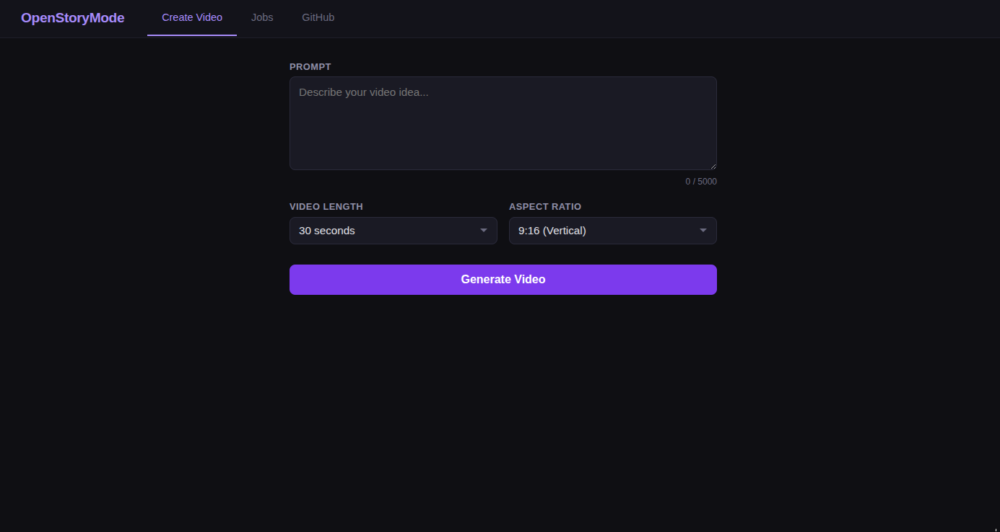
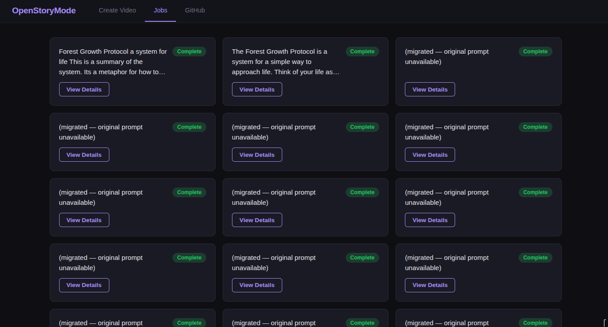
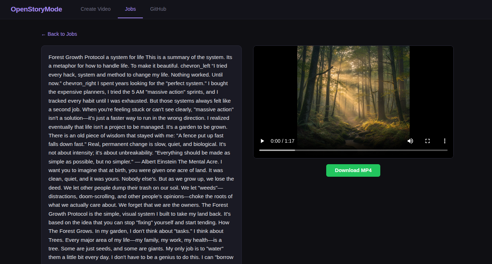

# OpenStoryMode

Open-source AI video generator. Type a prompt, get a narrated video with visuals — no editing required.

OpenStoryMode takes your idea, writes a scene-by-scene script using an LLM, generates images and narration for each scene, and assembles everything into an MP4. Built with Python, FastAPI, and vanilla JS. Runs locally on your machine via [OpenRouter](https://openrouter.ai/).

## Screenshots

### Create Page
The home page gives you a simple interface to enter your video idea, pick a length and aspect ratio, and kick off generation.



### Jobs Page
After submitting, you land on the Jobs page — a grid of all your video generation jobs with their current status. Click any card to see the full details.



### Job Details
The detail page shows the original prompt, metadata, and the generated scene-by-scene script on the left. Once the video is ready, it plays on the right (no autoplay).



## Prerequisites

- Python 3.10 or newer
- An [OpenRouter](https://openrouter.ai/) API key

## Setup

1. Clone the repo:

```bash
git clone https://github.com/mayurjobanputra/OpenStoryMode.git
cd OpenStoryMode
```

2. Start the app:

```bash
./start.sh
```

On first run, it will:
- Ask for your [OpenRouter API key](https://openrouter.ai/) and create a `.env` file
- Set up a Python virtual environment and install dependencies
- Start the server

Open http://localhost:8000 in your browser.

To use a different port:

```bash
PORT=8001 ./start.sh
```

### Manual Setup (if you prefer)

If you'd rather set things up yourself:

```bash
python3 -m venv .venv
.venv/bin/pip install -r requirements.txt
.venv/bin/uvicorn app.main:app --host 0.0.0.0 --port 8000
```

## Running Multiple Instances

You can run multiple copies of the app on the same machine in different folders. Each instance is self-contained with its own `output/` directory, job history, and `.env` config. Just use a different port for each:

```bash
PORT=8001 ./start.sh
```

## Utilities

### Migrate Legacy Jobs

If you have existing output directories from before the job history feature was added, run the migration script to generate `job.json` files so they appear in the Jobs view:

```bash
.venv/bin/python migrate_jobs.py
```

This is useful when:
- Upgrading from a version before job history was added
- Copying the app (with its `output/` folder) to another machine or directory

Safe to re-run — directories that already have a `job.json` are skipped. Restart the server afterward to load the migrated jobs.

## Other AI Providers

Currently OpenStoryMode only supports [OpenRouter](https://openrouter.ai/). Want to use a different provider (OpenAI, Anthropic, local models, etc.)? [Open an issue](https://github.com/mayurjobanputra/OpenStoryMode/issues) or fork the repo and submit a PR.

## License

MIT — see [LICENSE](LICENSE) for details.
